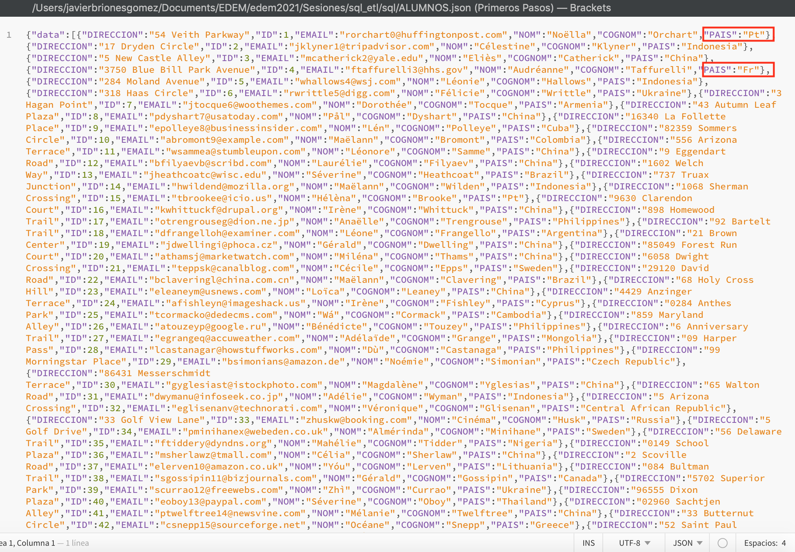

# ELT Exercises

- Professor :   [Pedro Nieto](https://github.com/a10pepo)
- Student:      [Javier Briones](https://github.com/jabrio)

## Exercise 01

```
Leer un archivo CSV y escribirlo a fichero JSON en la misma carpeta.
```

### Solution

##### Step 01: Load the CSV file as "File Delimited"


##### Step 02: Set CSV file properties


##### Step 03: Put the input and output file on the workspace


##### Step 04: Run talend job


##### Step 05: Check the result


## Exercise 02

```
Debéis leer un fichero CSV y reemplazar Portugal por “Pt” y France por “Fr”.
```

##### Step 01: Put "ALUMNOS.csv" as input file and a JSON as output file on the workspace


##### Step 02: Drag a tReplace component on the work space and set their properties


##### Step 03: Run Talend job


##### Step 04: Check the result



## Exercise 03

```
Leer la tabla “Actores” y volcarlo a un fichero JSON.
```

##### Step 01: Drag "Actor" from dvdrental database as input file and a JSON as output file on the workspace


##### Step 02: Sync the input and output schema


##### Step 03: Run Talend job


##### Step 04: Check the result


## Exercise 04

```
Agregar las películas por rating y mostrar un count, volcar a JSON el resultado.
```

##### Step 01: Drag "Film" from dvdrental database as input file and a JSON as output file on the workspace


##### Step 02: Drag "tAggregateRow" component on the workspace and set required properties


##### Step 03: Set required operations


##### Step 04: Run Talend job


##### Step 05: Check the results


## Exercise 05

```
Realizar un JOIN entre Actor | Film | Film_Actor y volcar a JSON un fichero con los campos: Nombre, Apellido y Película.
```

##### Step 01: Drag required tables from dvdrental database as input file and a JSON as output file on the workspace


##### Step 02: Drag "tMap" component on the workspace and set required operations


##### Step 03: Run Talend job


##### Step 04: Check the results


