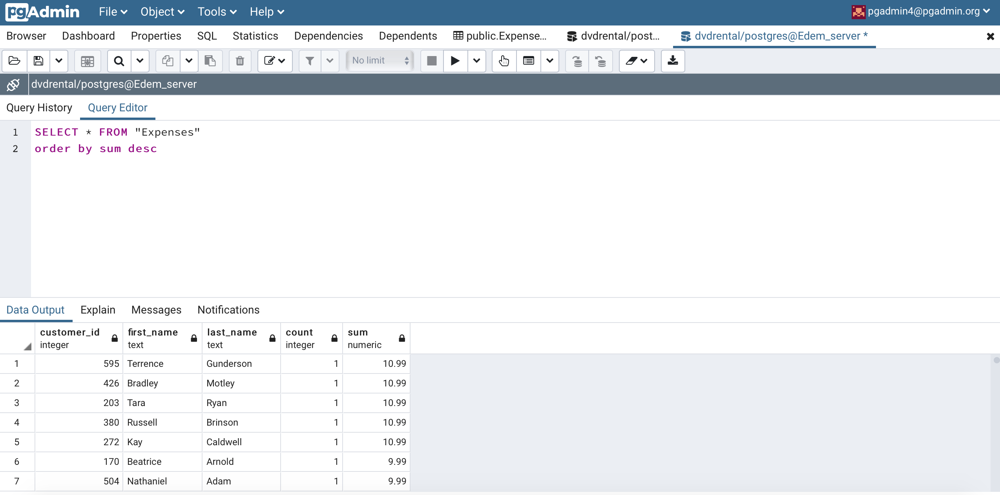
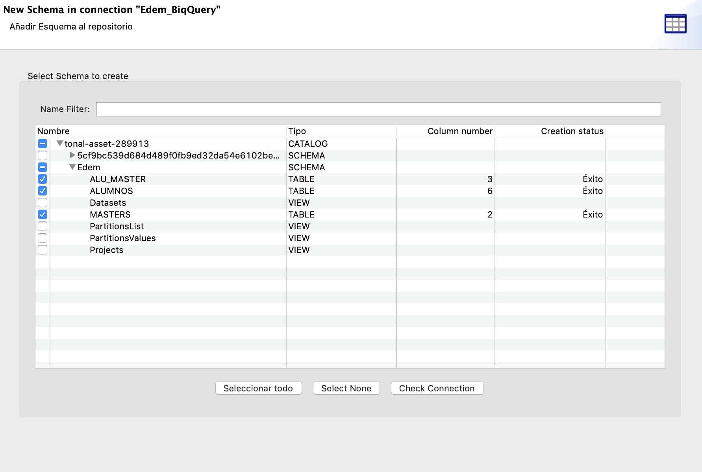

# ELT Exercises

- Professor :   [Pedro Nieto](https://github.com/a10pepo)
- Student:      [Javier Briones](https://github.com/jabrio)

## Exercise 01

```
Leer un archivo CSV y escribirlo a fichero JSON en la misma carpeta.
```

### Solution

##### Step 01: Load the CSV file as "File Delimited"


##### Step 02: Set CSV file properties


##### Step 03: Put the input and output file on the workspace


##### Step 04: Run talend job


##### Step 05: Check the result


## Exercise 02

```
Debéis leer un fichero CSV y reemplazar Portugal por “Pt” y France por “Fr”.
```

##### Step 01: Put "ALUMNOS.csv" as input file and a JSON as output file on the workspace


##### Step 02: Drag a tReplace component on the work space and set their properties


##### Step 03: Run Talend job


##### Step 04: Check the result


## Exercise 03

```
Leer la tabla “Actores” y volcarlo a un fichero JSON.
```

##### Step 01: Drag "Actor" from dvdrental database as input file and a JSON as output file on the workspace


##### Step 02: Sync the input and output schema


##### Step 03: Run Talend job


##### Step 04: Check the result


## Exercise 04

```
Agregar las películas por rating y mostrar un count, volcar a JSON el resultado.
```

##### Step 01: Drag "Film" from dvdrental database as input file and a JSON as output file on the workspace


##### Step 02: Drag "tAggregateRow" component on the workspace and set required properties


##### Step 03: Set required operations


##### Step 04: Run Talend job


##### Step 05: Check the results


## Exercise 05

```
Realizar un JOIN entre Actor | Film | Film_Actor y volcar a JSON un fichero con los campos: Nombre, Apellido y Película.
```

##### Step 01: Drag required tables from dvdrental database as input file and a JSON as output file on the workspace


##### Step 02: Drag "tMap" component on the workspace and set required operations


##### Step 03: Run Talend job


##### Step 04: Check the results


## Exercise 06

```
Cargar una tabla con el dinero gastado por usuario, nombre y apellido.
```

##### Step 01: From PgAdmin, create a table with required result


##### Step 02: Drag required tables from dvdrental database as input file and the new created table as output file on the workspace


##### Step 03: Drag "tMap" component on the workspace and set required operations


##### Step 04: Drag "tAggregateRow" component on the workspace and set required properties


##### Step 05: Run Talend job


##### Step 06: Check the results on PgAdmin




## Exercise 07

```
Cargar una tabla con el número de veces que se ha alquilado cada película, solo con aquellas que han sido alquiladas al menos una vez.
```

##### Step 01: From PgAdmin, create a table with required result


##### Step 02: Drag required tables from dvdrental database as input file and the new created table as output file on the workspace


##### Step 03: Drag "tMap" component on the workspace and set required operations


##### Step 04: Drag "tAggregateRow" component on the workspace and set required properties


##### Step 05: Drag "tSortRow" component on the workspace and set required properties


##### Step 06: Run Talend job


##### Step 07: Check the results on PgAdmin


## Exercise 08

```
BigQuery to Talend, filtrando algún elemento.
```
### Option A: CData Driver

[CData instructions](https://www.cdata.com/kb/tech/bigquery-jdbc-talend.rst)

##### Step 01: Update BigQuery database connection through downloaded driver


##### Step 02: Extract database schema



##### Step 03: Drag required table from BigQuery database as input file and JSON as output file on the workspace


##### Step 04: Make the query to obtain the result


##### Step 05: Run Talend job and check the result


### Option B

[BigQuery Service Account instructions](https://www.progress.com/tutorials/jdbc/connect-and-query-google-bigquery-using-jdbc-connector)

##### Step 01: Create a service account in GCP, as BigQuery Admin, and then create a key


##### Step 02: Drag "tBigQueryInput" component as input file and JSON as output file on the workspace


##### Step 03: Run Talend Job


##### Step 04: Check the result


