# Nifi+ELK Exercise

- Professor :   [Pedro Nieto](https://github.com/a10pepo)
- Student:      [Javier Briones](https://github.com/jabrio)

#### Part 01

```
Usando nifi+ELK, debéis presentar una solución que muestre, sobre un mapa, 
la disposición de delitos presentes en esta API:
https://data.cityofnewyork.us/Social-Services/311-Service-Requests-from-2010-to-Present/erm2-nwe9
```
#### Part 02

```
Existen otras fuentes de datos que proporcionan también llamadas al 311 de otras zonas, 
opcionalmente podéis concatenar más datasets y pintarlos de manera conjunta.
```

## Part 01: Nifi to ELK

##### Step 01: Prepare a Docker-compose file with the following containers

| Component | Port |
| --- | --- |
| Logstash | 9600 | 
| Filebeat |  | 
| Kibana | 5601 |
| Elasticsearch | 9200 |
| Nifi | 8080 |

##### Step 02: In NiFi, use the following processors

```
Invokehttp: To ingest vía API.
SplitJSON: To convert the obtained array in separated documents.
Putelasticsearchhttp: Data to elasticsearch, indentified by index.
```
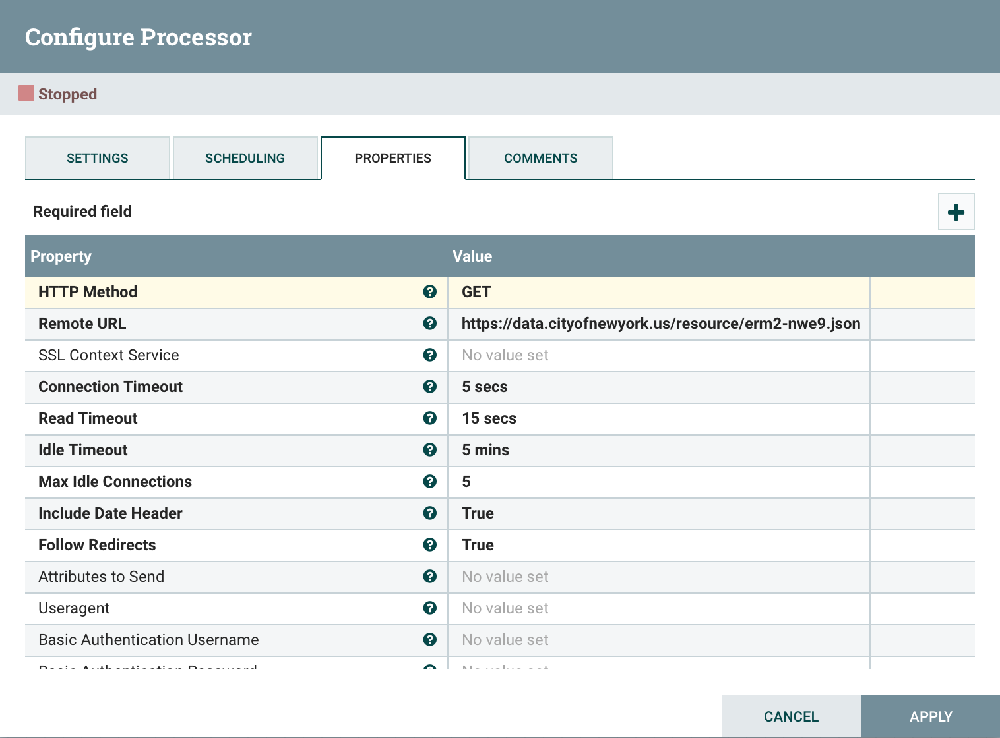
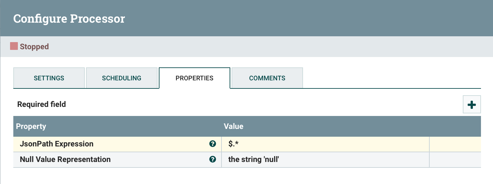
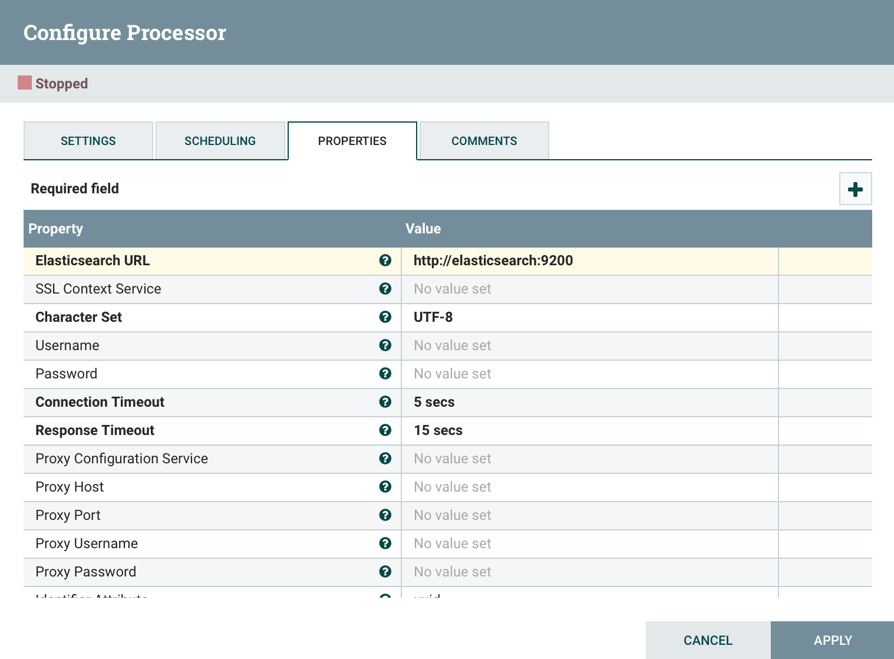

##### Step 03: Run NiFiFlow

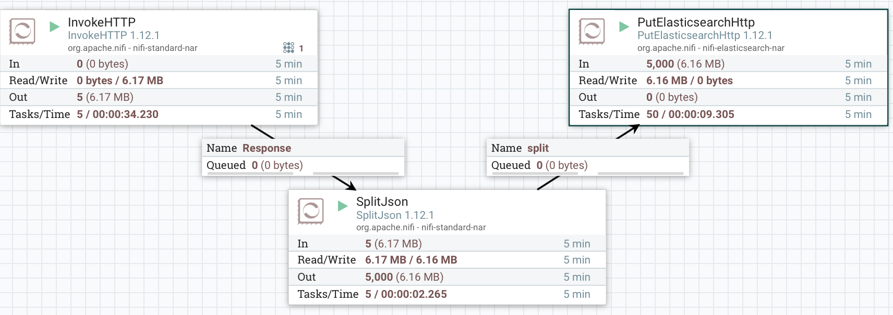

##### Step 04: Go to Localhost:5601 and check that index is created

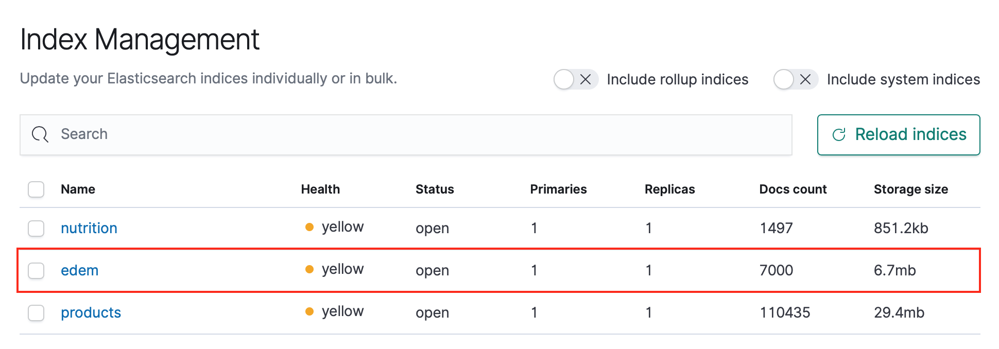

##### Step 05: Create a "Index Pattern" to visualize the data in Kibana. As can be seen, latitude and longitude are not a geo_point type.

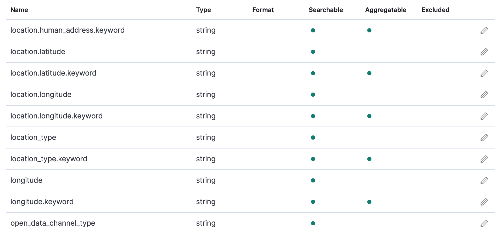

##### Step 06: Go to Kibana console and create a new index through Reindex API

###### Instructions: [Reindex API Elastic](https://www.elastic.co/guide/en/elasticsearch/reference/current/docs-reindex.html)

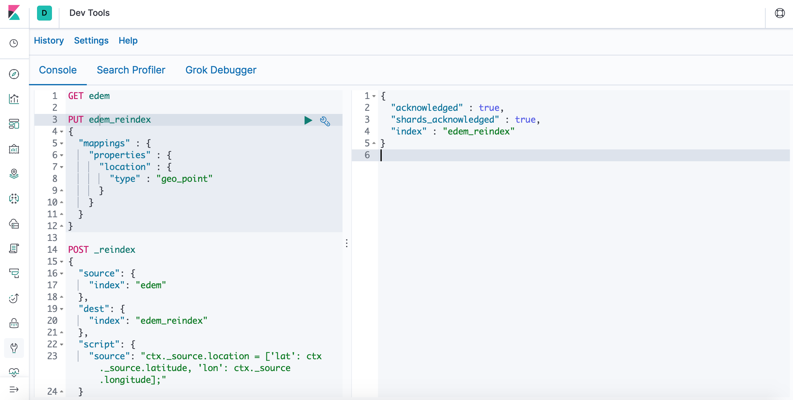

##### Step 07: Now, create again a "Index Pattern" with the new index. Now, check that "location" is geo_point type.

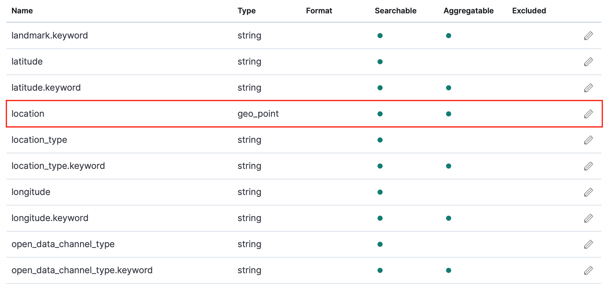

##### Step 08: Visualize the data.

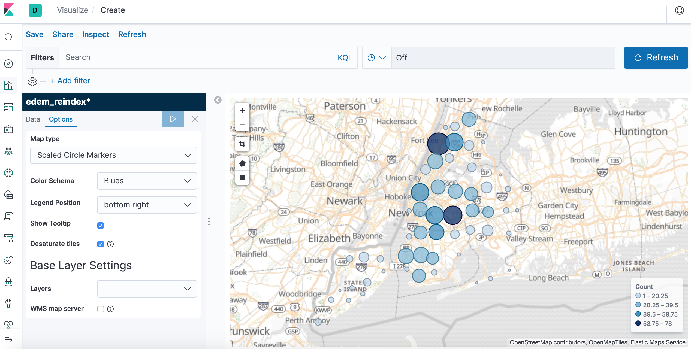

##### Final dashboard

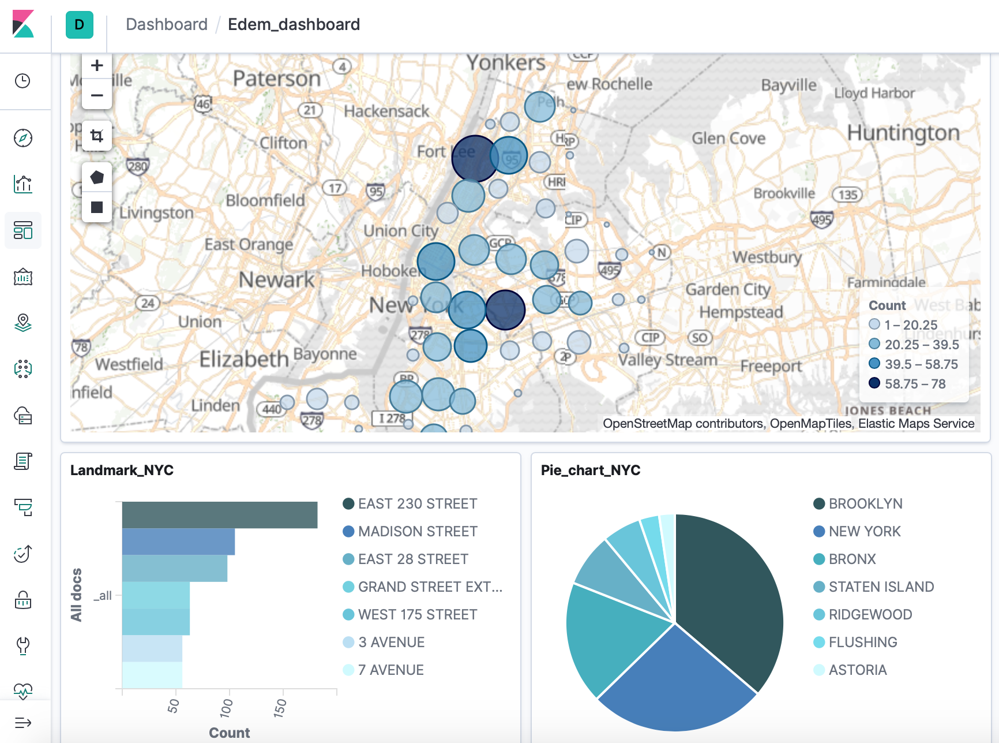


## Part 02: Combine with other datasets.

##### Step 01: Follow the same previous steps and visualize the data.
###### Source: [LA Open Data](https://data.lacity.org/)

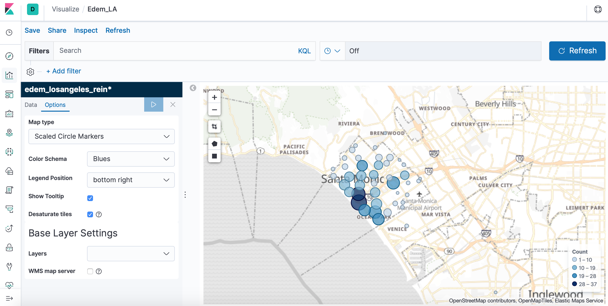

##### Step 02: Go to Kibana Maps and create a layer for each dataset.


